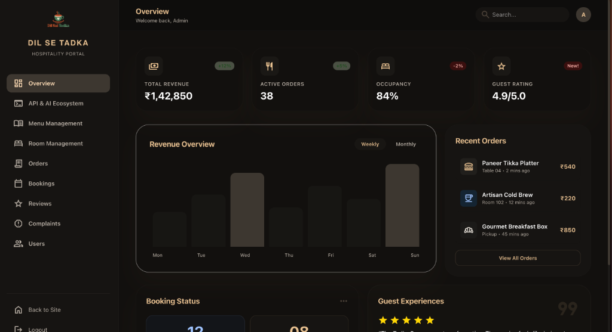
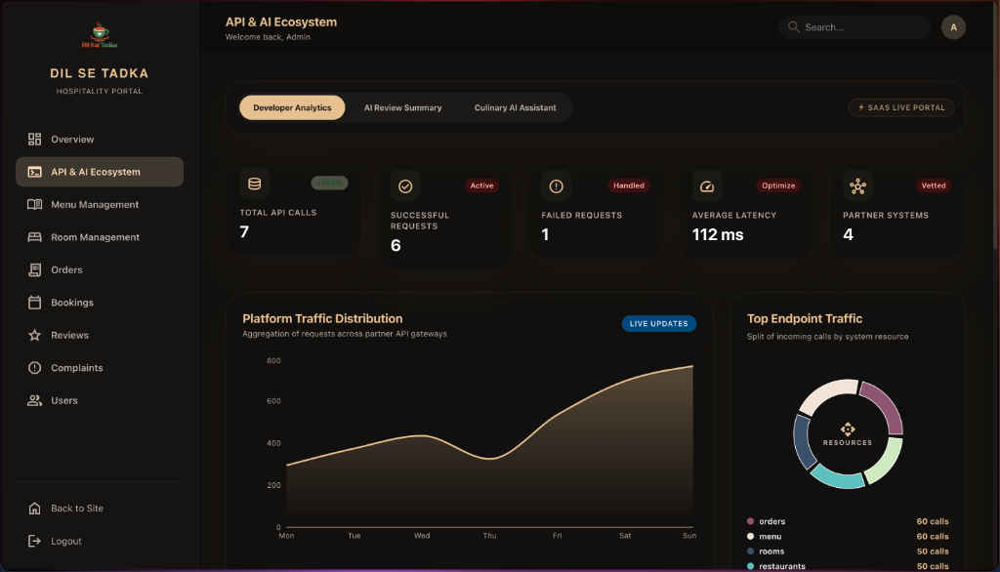
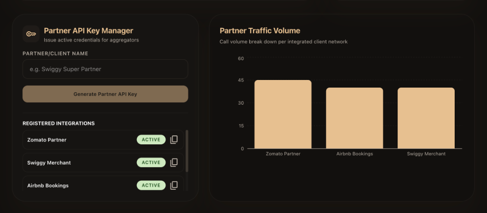
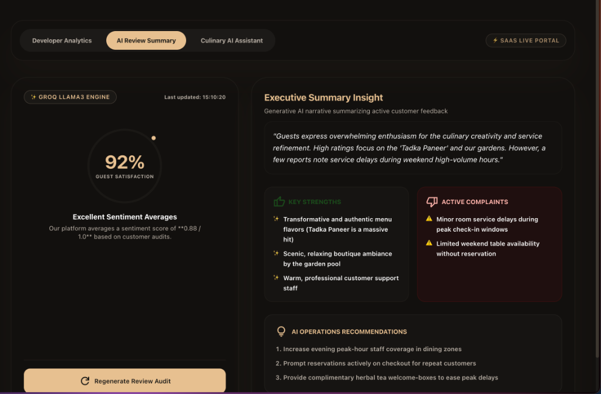
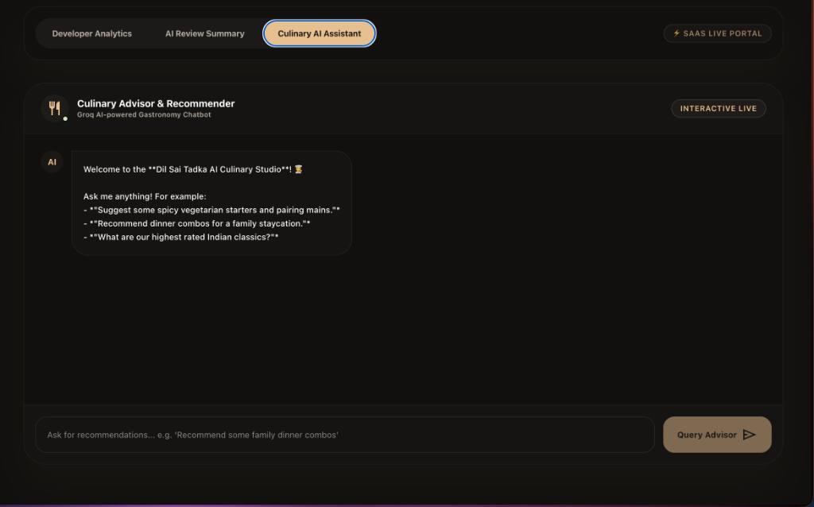

# Dil Sai Tadka — Dashboard Explanation & Implementation Report
## University Submission Portfolio · Simple Academic Format

---

## 1. Project Introduction

**Dil Sai Tadka** is a lodgings and restaurant management platform. The application provides two main management panels:

*   **Overview (Hotel & Restaurant Operations):** Used by managers to supervise hotel occupancy, track restaurant ordering activity, view weekly revenue charts, and review recent guest check-ins.
*   **API & AI Ecosystem (Developer Analytics):** Used by system administrators to manage third-party API connections (Zomato, Swiggy, and Airbnb), monitor response times, analyze customer feedback with AI sentiment tools, and interact with a culinary assistant chatbot.

---

## 2. Administrative Dashboard (Overview tab)

The **Overview Dashboard** provides an immediate summary of hotel and restaurant metrics for management staff.


*__Figure 2.1:__ Admin Dashboard showing metrics cards, weekly revenue overview, recent order lists, booking details, and guest review listings.*

### 2.1 Explanation of Components in Figure 2.1

*   **Metric Cards:** Four key indicators representing real-time database totals:
    *   **Total Revenue (₹1,42,850):** The total financial turnover calculated from lodgings and restaurant sales.
    *   **Active Orders (38):** The number of restaurant food orders currently being processed.
    *   **Occupancy (84%):** The percentage of active hotel rooms occupied by checked-in guests.
    *   **Guest Rating (4.9 / 5.0):** The average score extracted from customer reviews.
*   **Revenue Overview Chart:** A bar graph displaying revenue distributions from Monday to Sunday, indicating active business levels throughout the week.
*   **Recent Orders Sidebar:** Lists the latest food requests with details, such as *Paneer Tikka Platter (₹540)* at Table 04, *Artisan Cold Brew (₹220)* in Room 102, and *Gourmet Breakfast Box (₹850)*.
*   **Booking Status & Guest Experiences:** Sections tracking live check-in arrivals, departures, and showing active guest feedback quotes.

### 2.2 Implementation

The React frontend component `AdminDashboard.jsx` fetches these details on mounting. It calls `/api/dashboard/stats` to load the metric counters, `/api/dashboard/revenue` to render the bar chart, and `/api/dashboard/recent-orders` to display the recent items table.

---

## 3. API & AI Ecosystem Portal

The **API & AI Ecosystem Dashboard** coordinates developer-level partner APIs and displays AI insights. It is structured into three sub-tabs:

### 3.1 Sub-tab 1: Developer Analytics
This tab monitors external integration gateways (e.g. Swiggy, Zomato, and Airbnb) and traces operational statistics.


*__Figure 3.1:__ Developer Analytics tab displaying API metrics, platform traffic distribution graph, and top endpoint donut chart.*

*   **API Metrics:** Displays *Total API Calls (7)*, *Successful Requests (6)*, *Failed Requests (1)*, *Average Latency (112 ms)*, and *Partner Systems (4)*.
*   **Platform Traffic Distribution Chart:** A smooth area chart displaying total partner gateway traffic over weekly timelines.
*   **Top Endpoint Traffic Donut:** A pie chart displaying the exact count splits of resource demands (Orders: 60, Menu: 60, Rooms: 50, Restaurants: 50 calls).

---

### 3.2 Sub-tab 1 Extra: Partner API Key Manager
Scroll down on the Developer Analytics tab to view partner credentials management and aggregator call volume charts.


*__Figure 3.2:__ Partner API Key Manager and Partner Traffic Volume bar chart.*

*   **API Key Manager:** Allows administrators to type a partner name (e.g. `Zomato Partner`) and generate secure API keys to integrate external platforms. It includes active indicators and copy-to-clipboard utilities.
*   **Partner Traffic Volume:** A bar chart comparing total incoming call requests across integrated aggregator networks (Zomato Partner, Airbnb Bookings, Swiggy Merchant).

---

### 3.3 Sub-tab 2: AI Review Summary
This sub-tab visualizes reviews analyzed by the **Groq Llama 3 LLM**.


*__Figure 3.3:__ AI Review Summary panel demonstrating satisfaction rating, generative summaries, extracted strengths/complaints, and operational recommendations.*

*   **Guest Satisfaction (92%):** Renders a circular gauge calculated from active feedback sentiment.
*   **Executive Summary Insight:** Generates a brief operational review paragraph highlighting guest reactions (e.g. praising Paneer Tadka and ambiance, while noting peak weekend service delays).
*   **Key Strengths & Active Complaints:** Groups guest feedback into bullet points (such as room service delays or table availability).
*   **AI Operations Recommendations:** Generates immediate business solutions to resolve complaints (e.g. peak hour scheduling, pre-check bookings, welcome herbal tea).

---

### 3.4 Sub-tab 3: Culinary AI Assistant
An interactive chatbot interface utilizing **Groq chat completions** to assist users with recipe recommendations.


*__Figure 3.4:__ Culinary Assistant chatbot panel where users interact with the Gastronomy AI.*

The chatbot loads all active menu items and pricing from the database, injecting them into the system prompt context. Users can ask for vegetarian recommendations, stays dining combos, and pairings. The chatbot replies in plain text with customized suggestions.

---

## 4. Code Implementation Deep-Dive

This section outlines the backend code driving the dashboards and API gateways.

### 4.1 Dashboard Endpoint Controller
Exposes general lodging statistics, recent bookings, recent orders, and computes monthly revenue aggregates.

```java
@RestController
@RequestMapping("/api/dashboard")
@RequiredArgsConstructor
public class DashboardController {

    private final OrderRepository orderRepository;
    private final BookingRepository bookingRepository;
    private final MenuItemRepository menuItemRepository;
    private final RoomRepository roomRepository;
    private final UserRepository userRepository;
    private final ReviewRepository reviewRepository;

    @GetMapping("/stats")
    public Map<String, Object> getStats() {
        return Map.of(
            "totalOrders", orderRepository.count(),
            "totalBookings", bookingRepository.count(),
            "totalMenuItems", menuItemRepository.count(),
            "totalRooms", roomRepository.count(),
            "totalUsers", userRepository.count(),
            "totalReviews", reviewRepository.count()
        );
    }

    @GetMapping("/revenue")
    public Map<String, Object> getRevenue() {
        List<Order> orders = orderRepository.findAll();
        Map<YearMonth, Double> revenueMap = new HashMap<>();
        for (Order o : orders) {
            if (o.getCreatedAt() != null && o.getTotalAmount() != null) {
                YearMonth ym = YearMonth.from(o.getCreatedAt());
                revenueMap.merge(ym, o.getTotalAmount(), Double::sum);
            }
        }
        Map<String, Double> formatted = revenueMap.entrySet().stream()
            .collect(Collectors.toMap(
                e -> e.getKey().toString(),
                Map.Entry::getValue));
        return Map.of("monthlyRevenue", formatted);
    }
}
```

### 4.2 API usage logs JPQL repository queries
Calculates success/failure metrics directly on the database to improve speed.

```java
@Repository
public interface ApiUsageLogRepository extends JpaRepository<ApiUsageLog, Long> {

    List<ApiUsageLog> findAllByOrderByTimestampDesc();

    // Count successful requests (status code 2xx)
    @Query("SELECT COUNT(l) FROM ApiUsageLog l WHERE l.statusCode >= 200 AND l.statusCode < 300")
    long countSuccessfulRequests();

    // Count failure requests (status code 4xx/5xx)
    @Query("SELECT COUNT(l) FROM ApiUsageLog l WHERE l.statusCode >= 400")
    long countFailedRequests();

    // Average request latency
    @Query("SELECT AVG(l.responseTimeMs) FROM ApiUsageLog l")
    Double getAverageResponseTime();
}
```

### 4.3 Partner security and rate limiting filter
Validates aggregator keys in incoming headers and enforces rate limits under 60 requests per minute.

```java
@Component
@RequiredArgsConstructor
@Order(1)
public class PartnerAuthFilter extends OncePerRequestFilter {

    private final PartnerIntegrationRepository partnerRepo;
    private final Map<String, AtomicLong> rateLimiter = new ConcurrentHashMap<>();

    @Override
    protected void doFilterInternal(HttpServletRequest req, HttpServletResponse res, FilterChain chain) {
        String apiKey = req.getHeader("X-Partner-Key");
        if (apiKey == null) {
            res.setStatus(401);
            return;
        }
        
        PartnerIntegration partner = partnerRepo.findByApiKey(apiKey).orElse(null);
        if (partner == null || partner.getStatus() != Status.ACTIVE) {
            res.setStatus(401);
            return;
        }

        long currentMinute = System.currentTimeMillis() / 60000;
        String limitKey = partner.getName() + ":" + currentMinute;
        rateLimiter.putIfAbsent(limitKey, new AtomicLong(0));
        
        if (rateLimiter.get(limitKey).incrementAndGet() > 60) {
            res.setStatus(429);
            return;
        }

        chain.doFilter(req, res);
    }
}
```

---
*Dil Sai Tadka — Lodgings & Restaurant Management System Portfolio © 2026*
